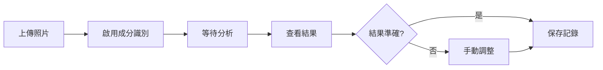

# 亞洲料理成分識別系統 - 用戶指南

## 目錄

1. [功能概述](#功能概述)
2. [快速開始](#快速開始)
3. [使用指南](#使用指南)
4. [最佳實踐](#最佳實踐)
5. [調整識別結果](#調整識別結果)
6. [常見問題解答](#常見問題解答)
7. [技術支援](#技術支援)

---

## 功能概述

### 什麼是成分識別？

成分識別功能能夠自動分析您上傳的亞洲料理照片，識別出料理中的各個成分（如炒飯中的蛋、青菜、火腿等），並為每個成分提供獨立的營養資訊。

### 主要功能

✅ **智能成分識別**：自動識別料理中的主要成分
✅ **營養分析**：為每個成分提供詳細的營養資訊
✅ **份量估計**：估計每個成分的重量（克）
✅ **烹飪方式識別**：識別成分的烹飪方式（炒、煮、炸等）
✅ **手動調整**：支持用戶手動添加、移除或調整成分
✅ **多料理支持**：支持湯品、炒菜、便當、麵食等多種料理類型

### 支持的料理類型

- 🍜 **湯品類**：味噌湯、蛋花湯、貢丸湯、酸辣湯、火鍋
- 🍚 **炒菜類**：炒飯、炒麵、炒青菜、宮保雞丁
- 🍱 **便當類**：台式便當、日式便當、韓式便當
- 🍝 **麵食類**：拉麵、烏龍麵、米粉、河粉
- 🥟 **點心類**：小籠包、餃子、燒賣、春捲
- 🍖 **燒烤類**：烤肉、燒雞、烤魚

---

## 快速開始

### 步驟 1：上傳照片

1. 打開健康營養追蹤 App
2. 點擊「拍照識別」或「上傳照片」
3. 選擇您要分析的料理照片

### 步驟 2：啟用成分識別

在上傳照片時，確保啟用「成分識別」選項：

**API 請求範例**：
```bash
curl -X POST https://your-api.com/api/photo/recognize \
  -H "Authorization: Bearer YOUR_TOKEN" \
  -F "image=@your-food-photo.jpg" \
  -F "includeComponents=true"
```

**Web 界面**：
- 在照片上傳頁面，勾選「顯示成分分析」選項

### 步驟 3：查看識別結果

系統會返回以下資訊：

1. **料理整體資訊**
   - 料理名稱（如「蛋炒飯」）
   - 料理類型（如「炒飯類」）
   - 總份量估計
   - 信心度

2. **成分列表**
   - 每個成分的名稱
   - 估計份量（克）
   - 烹飪方式
   - 營養資訊
   - 信心度

3. **營養摘要**
   - 總營養值
   - 按成分分類的營養
   - 按類別分類的營養

### 步驟 4：調整結果（可選）

如果識別結果不準確，您可以：
- 添加缺失的成分
- 移除錯誤的成分
- 調整成分份量

---

## 使用指南

### 基本使用流程



### API 使用範例

#### 1. 基本成分識別

```typescript
// 使用 TypeScript/JavaScript
const formData = new FormData();
formData.append('image', imageFile);
formData.append('includeComponents', 'true');

const response = await fetch('https://your-api.com/api/photo/recognize', {
  method: 'POST',
  headers: {
    'Authorization': `Bearer ${token}`
  },
  body: formData
});

const result = await response.json();
console.log('料理:', result.data.mainDish.name);
console.log('成分數量:', result.data.components.length);
```

#### 2. 查看成分詳情

```typescript
// 遍歷所有識別的成分
result.data.components.forEach(component => {
  console.log(`成分: ${component.name}`);
  console.log(`份量: ${component.estimatedPortion}g`);
  console.log(`熱量: ${component.actualNutrition.calories} kcal`);
  console.log(`信心度: ${(component.confidence * 100).toFixed(1)}%`);
  console.log('---');
});
```

#### 3. 查看營養摘要

```typescript
// 總營養值
const total = result.data.nutritionSummary.total;
console.log(`總熱量: ${total.calories} kcal`);
console.log(`總蛋白質: ${total.protein}g`);
console.log(`總碳水化合物: ${total.carbs}g`);
console.log(`總脂肪: ${total.fat}g`);

// 按成分分類
result.data.nutritionSummary.byComponent.forEach(item => {
  console.log(`${item.component.name}: ${item.portionNutrition.calories} kcal`);
});
```

### 回應格式說明

完整的 API 回應結構：

```json
{
  "success": true,
  "data": {
    "mainDish": {
      "name": "蛋炒飯",
      "type": "fried_rice",
      "confidence": 0.95,
      "estimatedTotalPortion": 300
    },
    "components": [
      {
        "id": "comp_1",
        "name": "白飯",
        "nameEn": "White Rice",
        "confidence": 0.98,
        "estimatedPortion": 200,
        "cookingMethod": "stir_fried",
        "visualFeatures": {
          "color": ["白色", "微黃"],
          "shape": "顆粒狀",
          "texture": "鬆散",
          "position": "主體"
        },
        "actualNutrition": {
          "calories": 260,
          "protein": 4.2,
          "carbs": 56.8,
          "fat": 2.6
        }
      }
    ],
    "nutritionSummary": {
      "total": { ... },
      "byComponent": [ ... ],
      "byCategory": [ ... ]
    },
    "suggestions": {
      "possibleMissingComponents": ["蔥花"],
      "portionAdjustments": [ ... ]
    }
  }
}
```

---

## 最佳實踐

### 拍照技巧

為了獲得最佳的識別效果，請遵循以下拍照建議：

#### ✅ 推薦做法

1. **光線充足**
   - 使用自然光或明亮的室內光
   - 避免強烈的陰影或反光
   - 確保所有成分都清晰可見

2. **角度適當**
   - 從正上方或 45 度角拍攝
   - 確保整道料理都在畫面中
   - 避免過度傾斜的角度

3. **距離合適**
   - 料理佔畫面的 60-80%
   - 不要太近（避免失焦）
   - 不要太遠（避免細節不清）

4. **背景簡潔**
   - 使用純色或簡單的背景
   - 避免雜亂的桌面
   - 移除不相關的物品

5. **成分可見**
   - 盡量展示料理的橫切面
   - 對於便當，確保每個區域都清晰
   - 對於湯品，可以稍微攪拌讓配料浮現

#### ❌ 避免做法

- ❌ 在昏暗環境下拍攝
- ❌ 使用閃光燈造成過度曝光
- ❌ 拍攝角度過於傾斜
- ❌ 料理被遮擋或不完整
- ❌ 照片模糊或失焦
- ❌ 多道料理混在一起

### 不同料理類型的拍攝建議

#### 🍜 湯品類

```
最佳拍攝方式：
- 從正上方俯拍
- 確保湯面配料清晰可見
- 可以用湯匙稍微攪拌，讓沉底的配料浮現
- 拍攝前等待湯面平靜
```

**範例**：
- ✅ 好：能看到豆腐、青蔥、海帶等配料
- ❌ 差：只看到湯面，配料都沉在底部

#### 🍚 炒飯/炒麵類

```
最佳拍攝方式：
- 45 度角拍攝
- 用叉子或筷子稍微撥開，展示內部成分
- 確保能看到米飯、蛋、蔬菜等不同顏色的成分
```

**範例**：
- ✅ 好：能清楚看到蛋、青豆、胡蘿蔔、火腿
- ❌ 差：只看到表面，內部成分不可見

#### 🍱 便當類

```
最佳拍攝方式：
- 從正上方俯拍
- 確保每個格子都清晰可見
- 光線均勻，避免陰影遮擋
- 可以稍微調整便當角度，讓所有菜色都清楚
```

**範例**：
- ✅ 好：主食、主菜、配菜都清晰可辨
- ❌ 差：某些格子被陰影遮擋或角度不佳

#### 🍝 麵食類

```
最佳拍攝方式：
- 45 度角拍攝
- 用筷子夾起部分麵條，展示配料
- 確保湯底和配料都可見（湯麵）
- 展示麵條和配料的混合狀態（乾麵）
```

**範例**：
- ✅ 好：能看到麵條、叉燒、筍乾、青菜、蛋
- ❌ 差：配料被麵條完全覆蓋

#### 🥟 點心類

```
最佳拍攝方式：
- 拍攝完整的點心
- 如果可能，拍攝一個切開的點心展示內餡
- 確保能看到外皮和內餡的質地
```

**範例**：
- ✅ 好：能看到小籠包的外皮和內部的肉餡
- ❌ 差：只看到外觀，無法判斷內餡

### 提高識別準確度的技巧

1. **提供上下文資訊**
   - 如果知道料理名稱，可以在備註中說明
   - 說明料理的地域風格（台式、日式、韓式等）
   - 提供用餐場所資訊（餐廳、家常、夜市等）

2. **多角度拍攝**
   - 對於複雜料理，可以拍攝多張照片
   - 從不同角度展示料理的不同部分
   - 系統會綜合分析多張照片

3. **分批識別**
   - 對於便當等多菜色料理，可以分別識別每道菜
   - 然後手動合併結果
   - 這樣可以獲得更準確的成分資訊

4. **及時調整**
   - 識別完成後立即檢查結果
   - 趁記憶猶新時調整不準確的部分
   - 添加系統未識別的成分

---

## 調整識別結果

### 為什麼需要調整？

雖然系統使用先進的 AI 技術，但在以下情況下可能需要手動調整：

- 🔍 **成分被遮擋**：某些成分在照片中不可見
- 🎨 **顏色相似**：成分顏色與背景相似，難以識別
- 🍲 **複雜料理**：成分過多或混合在一起
- 📏 **份量估計**：系統估計的份量與實際有差異
- 🌍 **地方特色**：特殊的地方料理或食材

### 調整方式

#### 1. 添加缺失的成分

**API 請求**：
```bash
POST /api/component-adjustment/add
Content-Type: application/json

{
  "recognitionId": "rec_123456",
  "component": {
    "name": "蔥花",
    "estimatedPortion": 5,
    "cookingMethod": "raw"
  }
}
```

**使用場景**：
- 系統未識別出某個明顯的成分
- 您知道料理中包含某個不可見的成分（如調料）

**步驟**：
1. 點擊「添加成分」按鈕
2. 輸入成分名稱（支持中文搜尋）
3. 選擇或輸入份量
4. 選擇烹飪方式（可選）
5. 確認添加

#### 2. 移除錯誤的成分

**API 請求**：
```bash
POST /api/component-adjustment/remove
Content-Type: application/json

{
  "recognitionId": "rec_123456",
  "componentId": "comp_5"
}
```

**使用場景**：
- 系統誤識別了不存在的成分
- 識別出的成分實際上是其他東西

**步驟**：
1. 在成分列表中找到錯誤的成分
2. 點擊成分旁的「×」或「移除」按鈕
3. 確認移除

#### 3. 調整成分份量

**API 請求**：
```bash
POST /api/component-adjustment/update-portion
Content-Type: application/json

{
  "recognitionId": "rec_123456",
  "componentId": "comp_2",
  "newPortion": 150
}
```

**使用場景**：
- 系統估計的份量明顯偏高或偏低
- 您知道實際的份量

**步驟**：
1. 點擊成分的份量數字
2. 輸入新的份量（克）
3. 系統會自動重新計算營養值
4. 確認更新

#### 4. 修改烹飪方式

**API 請求**：
```bash
POST /api/component-adjustment/update-cooking-method
Content-Type: application/json

{
  "recognitionId": "rec_123456",
  "componentId": "comp_3",
  "cookingMethod": "deep_fried"
}
```

**使用場景**：
- 系統識別的烹飪方式不正確
- 烹飪方式影響營養計算

**步驟**：
1. 點擊成分的烹飪方式
2. 從下拉選單選擇正確的方式
3. 系統會重新計算營養值
4. 確認更新

### 調整後的效果

調整成分後，系統會：

✅ **自動重新計算營養**
- 更新該成分的營養值
- 重新計算總營養值
- 更新各類別的營養佔比

✅ **保存調整記錄**
- 記錄您的調整歷史
- 用於改進未來的識別準確度
- 可以查看調整前後的對比

✅ **更新建議**
- 根據您的調整更新建議列表
- 提供更個性化的建議

### 批量調整

對於便當等多成分料理，您可以使用批量調整功能：

```bash
POST /api/component-adjustment/batch
Content-Type: application/json

{
  "recognitionId": "rec_123456",
  "adjustments": [
    {
      "action": "add",
      "component": { "name": "醬油", "estimatedPortion": 10 }
    },
    {
      "action": "remove",
      "componentId": "comp_8"
    },
    {
      "action": "update_portion",
      "componentId": "comp_2",
      "newPortion": 150
    }
  ]
}
```

### 調整建議

#### 份量調整參考

| 成分類型 | 參考份量 | 調整建議 |
|---------|---------|---------|
| 米飯 | 150-250g | 一碗飯約 200g |
| 雞蛋 | 50-60g | 一顆蛋約 50g |
| 肉類 | 80-150g | 手掌大小約 100g |
| 蔬菜 | 50-150g | 一份青菜約 100g |
| 豆腐 | 80-120g | 一塊豆腐約 100g |
| 調料 | 5-20g | 少量調味 |

#### 烹飪方式選擇

- **生食 (raw)**：沙拉、生魚片
- **水煮 (boiled)**：湯品配料、水煮蛋
- **清蒸 (steamed)**：蒸魚、蒸蛋
- **炒 (stir_fried)**：炒飯、炒菜
- **油炸 (deep_fried)**：炸雞、天婦羅
- **煎 (fried)**：煎蛋、煎魚
- **烤 (grilled)**：烤肉、烤魚
- **滷 (braised)**：滷肉、滷蛋
- **醃漬 (pickled)**：泡菜、醃菜

---

## 常見問題解答

### 一般問題

#### Q1: 成分識別需要額外付費嗎？

**A**: 成分識別是基本功能的擴展，使用標準訂閱即可使用。但由於使用了更多的 AI 分析資源，可能會計入您的 API 配額。

#### Q2: 成分識別需要多長時間？

**A**: 
- 簡單料理（1-3 個成分）：2-3 秒
- 中等複雜度（4-6 個成分）：3-5 秒
- 複雜料理（7+ 個成分）：5-8 秒

實際時間取決於網路速度和伺服器負載。

#### Q3: 可以離線使用成分識別嗎？

**A**: 目前成分識別需要連接網路，因為需要調用 AI 視覺分析服務。我們正在開發離線版本，將在未來版本中推出。

#### Q4: 成分識別支援哪些語言？

**A**: 目前主要支援：
- 繁體中文（台灣）
- 簡體中文
- 英文
- 日文（部分）

我們正在擴展更多語言支援。

### 識別準確度

#### Q5: 為什麼有些成分沒有被識別出來？

**A**: 可能的原因：
- 成分在照片中不可見或被遮擋
- 成分太小或顏色與背景相似
- 成分是系統尚未學習的特殊食材
- 照片質量不佳（模糊、光線不足等）

**解決方法**：
- 重新拍攝更清晰的照片
- 手動添加缺失的成分
- 提供反饋幫助系統改進

#### Q6: 為什麼識別出了錯誤的成分？

**A**: 可能的原因：
- 成分外觀相似（如豆腐和魚肉）
- 照片角度或光線造成誤判
- 料理呈現方式特殊

**解決方法**：
- 手動移除錯誤的成分
- 從不同角度重新拍攝
- 提供反饋幫助系統學習

#### Q7: 份量估計準確嗎？

**A**: 份量估計基於：
- 視覺分析（成分在照片中的大小）
- 知識庫（該料理的典型份量）
- 參考物體（如餐具、容器）

準確度通常在 ±25% 範圍內。對於重要的營養追蹤，建議手動調整份量。

#### Q8: 信心度是什麼意思？

**A**: 信心度表示系統對識別結果的確定程度：
- **90-100%**：非常確定，通常準確
- **70-89%**：較為確定，建議檢查
- **50-69%**：不太確定，標記為「可能的成分」
- **<50%**：不確定，通常不會顯示

建議重點檢查信心度低於 80% 的成分。

### 營養計算

#### Q9: 營養資訊從哪裡來？

**A**: 營養資訊來源：
1. **官方資料庫**：台灣食品營養成分資料庫
2. **知識庫**：系統內建的亞洲食材資料庫
3. **用戶貢獻**：經過驗證的用戶提供的資料

所有資料都經過營養師審核。

#### Q10: 為什麼同樣的成分，營養值不同？

**A**: 營養值受以下因素影響：
- **烹飪方式**：炸、煮、蒸等方式影響營養
- **份量**：不同份量的營養值不同
- **品種差異**：不同品種的食材營養略有差異
- **新鮮度**：新鮮度影響營養保留

系統會根據烹飪方式自動調整營養計算。

#### Q11: 如何理解「烹飪影響」？

**A**: 烹飪影響顯示烹飪過程對營養的改變：

**範例**：
```
原始營養（生食）：100 kcal
烹飪方式：油炸
烹飪影響：+30 kcal（油脂吸收）
實際營養：130 kcal
```

不同烹飪方式的影響：
- **清蒸**：營養保留最好，幾乎無額外熱量
- **水煮**：營養保留良好，無額外熱量
- **炒**：增加 20-30% 熱量（油脂）
- **油炸**：增加 50-100% 熱量（大量油脂）
- **烤**：營養保留中等，少量熱量增加

### 特殊料理

#### Q12: 火鍋怎麼識別？

**A**: 火鍋建議分批識別：
1. 先拍攝所有食材（煮前）
2. 分別識別每種食材
3. 手動記錄實際吃的份量
4. 系統會自動計算總營養

或者：
1. 拍攝煮好的火鍋
2. 系統識別可見的配料
3. 手動添加不可見的配料
4. 調整份量

#### Q13: 便當怎麼識別最準確？

**A**: 便當識別建議：

**方法一：整體識別**
- 從正上方拍攝整個便當
- 系統會自動識別各個區域
- 檢查並調整識別結果

**方法二：分區識別**（更準確）
- 分別拍攝主食、主菜、配菜
- 分別識別每個部分
- 系統會自動合併結果

推薦使用方法二以獲得最佳準確度。

#### Q14: 湯品的湯底怎麼計算？

**A**: 湯底營養計算：
- 系統會識別湯的類型（清湯、濃湯、味噌等）
- 估計湯的總量
- 根據湯底類型計算基礎營養
- 加上配料的營養

如果您只喝了部分湯，可以調整湯底的份量。

#### Q15: 混合料理（如炒飯）怎麼識別？

**A**: 混合料理識別流程：
1. 系統識別料理類型（如「蛋炒飯」）
2. 從知識庫獲取常見成分
3. 通過視覺分析確認可見成分
4. 估計各成分份量
5. 提供可能缺失的成分建議

建議：
- 拍照時稍微撥開，展示內部成分
- 檢查建議列表，添加缺失成分
- 調整份量以符合實際

### 技術問題

#### Q16: 為什麼上傳照片失敗？

**A**: 可能的原因：
- 照片檔案太大（建議 < 10MB）
- 網路連接不穩定
- 照片格式不支援（支援 JPG、PNG、WEBP）
- 伺服器暫時繁忙

**解決方法**：
- 壓縮照片後重試
- 檢查網路連接
- 轉換照片格式
- 稍後再試

#### Q17: 為什麼識別速度很慢？

**A**: 可能的原因：
- 網路速度慢
- 照片檔案太大
- 料理複雜度高（成分多）
- 伺服器負載高

**解決方法**：
- 使用較小的照片檔案
- 在網路狀況好時使用
- 避開使用高峰時段

#### Q18: 可以批量識別多張照片嗎？

**A**: 可以，但建議：
- 一次最多 5 張照片
- 確保每張照片都清晰
- 等待所有照片處理完成
- 逐一檢查識別結果

批量識別適合：
- 一餐多道菜
- 便當的不同角度
- 同一料理的不同部分

### 隱私和安全

#### Q19: 我的照片會被保存嗎？

**A**: 
- **預設**：照片僅用於即時分析，不會永久保存
- **選擇性保存**：您可以選擇保存照片到個人記錄
- **改進用途**：如果您同意，匿名化的照片可能用於改進系統

所有資料都經過加密處理，符合隱私保護法規。

#### Q20: 我的飲食資料安全嗎？

**A**: 我們採取多重安全措施：
- 🔒 資料傳輸加密（HTTPS/TLS）
- 🔒 資料庫加密存儲
- 🔒 定期安全審計
- 🔒 符合 GDPR 和個資法規範
- 🔒 您可以隨時刪除您的資料

### 反饋和改進

#### Q21: 如何提供反饋？

**A**: 您可以通過以下方式提供反饋：

1. **即時反饋**（推薦）
   - 在識別結果頁面點擊「反饋」按鈕
   - 標記不準確的成分
   - 提供正確的資訊

2. **詳細反饋**
   - 進入「設定」→「反饋與建議」
   - 填寫詳細的反饋表單
   - 可以附加照片和說明

3. **聯繫客服**
   - Email: support@health-nutrition-app.com
   - App 內客服聊天
   - 社群媒體

#### Q22: 我的反饋會如何被使用？

**A**: 您的反饋將用於：
- 🎯 改進 AI 識別模型
- 📚 擴充知識庫
- 🔧 修復系統錯誤
- ✨ 開發新功能

所有反饋都會被匿名化處理，不會洩露個人資訊。

#### Q23: 可以建議新增料理類型嗎？

**A**: 當然可以！我們歡迎建議：
- 新的料理類型
- 地方特色料理
- 特殊食材
- 烹飪方式

請通過反饋系統提交您的建議，包括：
- 料理名稱和描述
- 常見成分
- 參考照片（如果有）
- 地域或文化背景

---

## 進階使用

### 自訂成分資料庫

對於經常食用的特殊料理，您可以建立自訂成分資料庫：

#### 步驟：

1. **記錄常用料理**
   - 識別並調整您的常用料理
   - 保存為「我的料理」
   - 系統會記住您的調整

2. **快速識別**
   - 下次拍攝相同料理時
   - 系統會優先使用您的自訂資料
   - 識別更快更準確

3. **分享給家人**
   - 可以將自訂料理分享給家庭成員
   - 全家使用統一的標準
   - 更好地追蹤家庭營養

### 營養目標追蹤

結合成分識別，您可以：

#### 1. 設定營養目標

```
每日目標：
- 熱量：2000 kcal
- 蛋白質：80g
- 碳水化合物：250g
- 脂肪：65g
```

#### 2. 追蹤成分攝取

系統會自動統計：
- 每種成分的攝取頻率
- 各類別食物的比例
- 營養素來源分析

#### 3. 獲得個性化建議

基於您的飲食習慣：
- 建議增加或減少某些成分
- 推薦營養均衡的料理
- 提供替代方案

### 與其他功能整合

#### 1. 與食譜功能整合

- 識別料理後可以查看相似食譜
- 學習如何製作更健康的版本
- 了解不同烹飪方式的營養差異

#### 2. 與運動追蹤整合

- 根據運動消耗調整飲食建議
- 運動後的營養補充建議
- 熱量平衡分析

#### 3. 與健康報告整合

- 生成詳細的飲食分析報告
- 追蹤長期的營養趨勢
- 發現飲食模式和健康關聯

### API 進階使用

#### 自訂識別參數

```typescript
const response = await fetch('/api/photo/recognize', {
  method: 'POST',
  headers: {
    'Authorization': `Bearer ${token}`,
    'Content-Type': 'application/json'
  },
  body: JSON.stringify({
    image: base64Image,
    includeComponents: true,
    options: {
      // 最小信心度閾值
      minConfidence: 0.7,
      
      // 最大成分數量
      maxComponents: 10,
      
      // 是否使用知識庫增強
      useKnowledgeBase: true,
      
      // 地域偏好
      regionPreference: 'taiwan',
      
      // 是否包含建議
      includeSuggestions: true,
      
      // 詳細程度
      detailLevel: 'full' // 'basic' | 'standard' | 'full'
    }
  })
});
```

#### 批量處理

```typescript
// 批量識別多張照片
const batchResponse = await fetch('/api/photo/recognize/batch', {
  method: 'POST',
  body: formData // 包含多個圖片檔案
});

// 批量調整成分
const adjustResponse = await fetch('/api/component-adjustment/batch', {
  method: 'POST',
  body: JSON.stringify({
    recognitionId: 'rec_123',
    adjustments: [...]
  })
});
```

#### Webhook 通知

設定 webhook 以接收識別完成通知：

```typescript
// 設定 webhook
await fetch('/api/settings/webhook', {
  method: 'POST',
  body: JSON.stringify({
    url: 'https://your-server.com/webhook',
    events: ['recognition.completed', 'component.adjusted']
  })
});

// Webhook 接收的資料格式
{
  "event": "recognition.completed",
  "timestamp": "2025-11-17T10:30:00Z",
  "data": {
    "recognitionId": "rec_123",
    "mainDish": { ... },
    "components": [ ... ]
  }
}
```

---

## 技術支援

### 獲取幫助

如果您遇到問題或需要協助：

#### 1. 查看文檔

- 📖 [API 文檔](./COMPONENT_DETECTION_API_DOCUMENTATION.md)
- 🧪 [測試指南](./apps/api/src/__tests__/test-data/QUICK_TEST_GUIDE.md)
- 🔧 [技術文檔](../.kiro/specs/food-recognition-accuracy/TECHNICAL_DOCUMENTATION.md)

#### 2. 常見問題

- 先查看本文檔的「常見問題解答」部分
- 搜尋社群論壇的相關討論
- 查看已知問題列表

#### 3. 聯繫支援

**Email 支援**
- 📧 support@health-nutrition-app.com
- 回應時間：24-48 小時

**即時聊天**
- 💬 App 內客服聊天
- 服務時間：週一至週五 9:00-18:00 (GMT+8)

**社群支援**
- 💬 Discord 社群
- 📱 Facebook 社團
- 🐦 Twitter @HealthNutritionApp

### 報告問題

報告問題時，請提供：

1. **問題描述**
   - 發生了什麼
   - 預期的行為
   - 實際的行為

2. **重現步驟**
   - 詳細的操作步驟
   - 使用的料理類型
   - 照片特徵（如果可以分享）

3. **環境資訊**
   - App 版本
   - 裝置型號和作業系統
   - 網路環境

4. **錯誤訊息**
   - 完整的錯誤訊息
   - 錯誤代碼（如果有）
   - 截圖（如果適用）

### 功能請求

我們歡迎功能建議！請提供：

1. **功能描述**
   - 您想要什麼功能
   - 為什麼需要這個功能
   - 如何使用這個功能

2. **使用場景**
   - 具體的使用案例
   - 預期的效益
   - 頻率和重要性

3. **參考範例**
   - 其他 App 的類似功能
   - 設計草圖或示意圖
   - 相關資料或研究

---

## 更新日誌

### v1.0.0 (2025-11-17)

🎉 **初始版本發布**

**新功能**：
- ✨ 亞洲料理成分識別
- ✨ 支援 6 大料理類型
- ✨ 智能份量估計
- ✨ 烹飪方式識別
- ✨ 營養計算和分析
- ✨ 手動調整功能
- ✨ 反饋收集系統

**支援的料理**：
- 🍜 湯品類（5+ 種）
- 🍚 炒菜類（4+ 種）
- 🍱 便當類（3+ 種）
- 🍝 麵食類（4+ 種）
- 🥟 點心類（4+ 種）
- 🍖 燒烤類（3+ 種）

**知識庫**：
- 📚 100+ 種亞洲食材
- 🗺️ 4 個地域（台灣、日本、韓國、中國）
- 🍳 9 種烹飪方式

### 即將推出

**v1.1.0 (預計 2025-12)**
- 🔜 更多東南亞料理支援
- 🔜 離線識別模式
- 🔜 AR 成分標註
- 🔜 語音輸入調整

**v1.2.0 (預計 2026-Q1)**
- 🔜 機器學習個性化
- 🔜 家庭共享功能
- 🔜 食譜推薦整合
- 🔜 營養師諮詢整合

---

## 附錄

### A. 支援的料理類型完整列表

#### 湯品類 (Soup)
- 味噌湯、蛋花湯、貢丸湯、酸辣湯、玉米濃湯
- 排骨湯、雞湯、魚湯、海鮮湯
- 火鍋（麻辣、清湯、壽喜燒等）

#### 炒菜類 (Stir-Fry)
- 蛋炒飯、揚州炒飯、鳳梨炒飯
- 炒麵、炒米粉、炒河粉
- 炒青菜、宮保雞丁、魚香茄子

#### 便當類 (Bento)
- 台式便當、日式便當、韓式便當
- 飯糰、三明治便當
- 分格餐盒

#### 麵食類 (Noodles)
- 拉麵、烏龍麵、蕎麥麵
- 米粉、河粉、粿條
- 湯麵、乾麵、炒麵

#### 點心類 (Dim Sum)
- 小籠包、餃子、燒賣、春捲
- 包子、饅頭、蔥油餅
- 蛋塔、芝麻球

#### 燒烤類 (Barbecue)
- 烤肉、燒雞、烤魚
- 串燒、鐵板燒
- 韓式烤肉

### B. 烹飪方式對照表

| 中文 | 英文 | 營養影響 |
|-----|------|---------|
| 生食 | raw | 無影響 |
| 水煮 | boiled | 維生素流失 10-20% |
| 清蒸 | steamed | 營養保留最佳 |
| 炒 | stir_fried | 熱量 +20-30% |
| 油炸 | deep_fried | 熱量 +50-100% |
| 煎 | fried | 熱量 +30-40% |
| 烤 | grilled | 熱量 +10-20% |
| 滷 | braised | 鈉含量增加 |
| 醃漬 | pickled | 鈉含量大幅增加 |

### C. 成分類別說明

| 類別 | 說明 | 範例 |
|-----|------|------|
| 穀物 (Grain) | 主食類 | 米飯、麵條、麵包 |
| 蛋白質 (Protein) | 肉類、蛋、豆類 | 雞肉、豆腐、蛋 |
| 蔬菜 (Vegetable) | 各種蔬菜 | 青菜、胡蘿蔔、菇類 |
| 調味料 (Seasoning) | 調味品 | 醬油、鹽、糖 |
| 醬汁 (Sauce) | 醬料 | 番茄醬、沙拉醬 |
| 配菜 (Garnish) | 裝飾配菜 | 蔥花、香菜、芝麻 |

### D. 信心度解讀

| 信心度 | 含義 | 建議 |
|-------|------|------|
| 90-100% | 非常確定 | 通常準確，可直接使用 |
| 80-89% | 確定 | 建議快速檢查 |
| 70-79% | 較為確定 | 建議仔細檢查 |
| 60-69% | 不太確定 | 標記為「可能」，建議調整 |
| <60% | 不確定 | 通常不顯示，或標記為低信心度 |

### E. 術語表

- **成分 (Component)**：料理中的個別食材或配料
- **份量 (Portion)**：成分的重量，以克為單位
- **信心度 (Confidence)**：系統對識別結果的確定程度，0-1 之間
- **烹飪方式 (Cooking Method)**：食材的烹調方法
- **營養值 (Nutrition)**：食物的營養成分，包括熱量、蛋白質、碳水化合物、脂肪等
- **知識庫 (Knowledge Base)**：系統內建的食材和料理資料庫
- **視覺特徵 (Visual Features)**：成分的外觀特徵，如顏色、形狀、質地

---

## 結語

感謝您使用亞洲料理成分識別功能！

我們致力於提供最準確、最便捷的營養追蹤體驗。您的反饋對我們非常重要，幫助我們不斷改進系統。

如果您有任何問題、建議或反饋，請隨時聯繫我們。

祝您健康飲食，生活愉快！🎉

---

**文檔版本**: v1.0.0  
**最後更新**: 2025-11-17  
**維護者**: Health Nutrition App Team  
**聯繫方式**: support@health-nutrition-app.com
