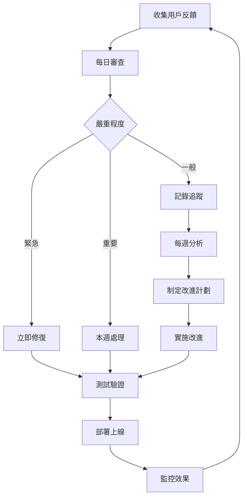

# 食物識別準確度改進 - 持續改進流程

## 概述

本文檔定義了食物識別系統的持續改進流程，包括定期測試、反饋審查機制和知識庫更新計劃。

---

## 目錄

1. [持續改進原則](#持續改進原則)
2. [定期測試流程](#定期測試流程)
3. [反饋審查機制](#反饋審查機制)
4. [知識庫更新計劃](#知識庫更新計劃)
5. [Prompt 優化流程](#prompt-優化流程)
6. [性能監控和優化](#性能監控和優化)
7. [團隊協作流程](#團隊協作流程)

---

## 持續改進原則

### 核心理念

1. **數據驅動**: 所有改進決策基於實際數據和用戶反饋
2. **快速迭代**: 小步快跑，持續優化
3. **用戶中心**: 以提升用戶體驗為首要目標
4. **可測量**: 所有改進都有明確的成功指標
5. **可回滾**: 確保任何改進都可以快速回滾

### 改進週期

```
收集數據 → 分析問題 → 設計方案 → 實施改進 → 測試驗證 → 部署上線 → 監控效果 → 收集數據
```

### 成功指標

#### 短期指標（每週）
- 識別準確率提升 >= 0.5%
- 用戶修正率下降 >= 1%
- 平均信心度提升 >= 1%

#### 中期指標（每月）
- 識別準確率提升 >= 2%
- 用戶滿意度提升 >= 0.1 分
- 常見錯誤減少 >= 20%

#### 長期指標（每季）
- 識別準確率達到 >= 90%
- 用戶滿意度達到 >= 4.5/5.0
- 用戶修正率 < 15%

---

## 定期測試流程

### 每日自動測試

#### 1. 健康檢查測試

**時間**: 每天 00:00、06:00、12:00、18:00

**測試內容**:
- API 可用性
- 資料庫連接
- OpenAI API 連接
- Redis 連接
- 磁碟空間

**自動化腳本**:
```bash
# 添加到 crontab
0 */6 * * * /path/to/scripts/health-check.sh
```


#### 2. 基礎功能測試

**時間**: 每天 02:00

**測試內容**:
- 照片上傳和識別
- 知識庫查詢
- 結果驗證
- 反饋提交

**自動化腳本**:
```bash
#!/bin/bash
# scripts/daily-functional-test.sh

npm run test:functional -- --run
```

**添加到 crontab**:
```bash
0 2 * * * /path/to/scripts/daily-functional-test.sh
```

### 每週準確度測試

#### 1. 標準測試集測試

**時間**: 每週一 03:00

**測試內容**:
- 使用標準測試圖片集（100張）
- 計算準確率、召回率、F1 分數
- 生成混淆矩陣
- 識別常見錯誤模式

**執行命令**:
```bash
npm run test:accuracy:weekly
```

**自動化配置**:
```bash
# 添加到 crontab
0 3 * * 1 /path/to/scripts/weekly-accuracy-test.sh
```

#### 2. 新增測試案例

**流程**:
1. 從上週的用戶反饋中選擇 10-20 個錯誤案例
2. 添加到測試集
3. 標註正確答案
4. 運行測試
5. 記錄結果

**測試集管理**:
```bash
# 添加新測試案例
npm run test:add-case -- --image=path/to/image.jpg --label="豆腐干絲,芹菜,胡蘿蔔絲"

# 更新測試集
npm run test:update-dataset

# 驗證測試集
npm run test:verify-dataset
```

### 每月性能測試

**時間**: 每月 1 號 04:00

**測試內容**:
- 識別速度測試
- 並發性能測試
- 記憶體使用測試
- 資料庫性能測試

**執行命令**:
```bash
npm run test:performance:monthly
```

**報告生成**:
```bash
# 生成月度性能報告
npm run report:performance -- --month=$(date +%Y-%m)
```

### 測試報告

#### 自動生成報告

測試完成後自動生成報告並發送：

```javascript
// scripts/generate-test-report.js
const { generateReport, sendReport } = require('./utils/reporting');

async function main() {
  const report = await generateReport({
    type: 'weekly',
    date: new Date(),
    metrics: {
      accuracy: 87.5,
      precision: 89.2,
      recall: 86.8,
      f1Score: 0.88
    },
    commonErrors: [
      { incorrect: '麵條', correct: '豆腐干絲', count: 12 },
      { incorrect: '青椒', correct: '糯米椒', count: 8 }
    ]
  });
  
  // 發送報告
  await sendReport(report, {
    email: ['team@nutrition-app.com'],
    slack: '#food-recognition-updates'
  });
}

main();
```

---

## 反饋審查機制

### 每日反饋審查

**時間**: 每天 10:00

**負責人**: 輪值工程師

**流程**:

1. **查看新反饋**
```bash
npm run feedback:review -- --since=yesterday
```

2. **分類反饋**
- 🔴 緊急（嚴重錯誤）: 立即處理
- 🟡 重要（常見錯誤）: 本週處理
- 🟢 一般（偶發錯誤）: 記錄追蹤

3. **記錄問題**
```bash
# 創建問題追蹤
npm run issue:create -- --type=recognition-error --description="豆腐干絲被誤識別為麵條"
```

4. **快速修復**（如果可能）
- 更新 prompt 模板
- 添加易混淆警告
- 更新知識庫

### 每週反饋分析會議

**時間**: 每週五 15:00

**參與者**: 開發團隊、產品經理

**議程**:

1. **回顧本週反饋統計**（15分鐘）
```bash
npm run feedback:stats -- --week=current
```

輸出範例:
```
本週反饋統計 (2025-11-11 ~ 2025-11-17)
========================================
總反饋數: 156
正確識別: 132 (84.6%)
錯誤識別: 24 (15.4%)

常見錯誤 Top 5:
1. 麵條 → 豆腐干絲 (12次)
2. 青椒 → 糯米椒 (8次)
3. 米粉 → 粉絲 (6次)
4. 筍子 → 玉米筍 (5次)
5. 空心菜 → 過貓 (4次)

用戶滿意度: 4.2/5.0 (↑0.1)
平均信心度: 86.3% (↑1.2%)
```

2. **分析錯誤模式**（20分鐘）
- 識別錯誤的共同特徵
- 圖片品質問題
- prompt 不足之處
- 知識庫缺失

3. **制定改進計劃**（15分鐘）
- 優先級排序
- 分配責任人
- 設定完成時間

4. **追蹤上週改進效果**（10分鐘）
- 檢查改進是否有效
- 調整策略

### 每月反饋深度分析

**時間**: 每月第一個週五

**分析內容**:

1. **趨勢分析**
```bash
npm run feedback:analyze:trends -- --month=current
```

2. **用戶行為分析**
- 哪些食材最常被修正
- 哪些料理類型識別困難
- 用戶最常使用的功能

3. **改進效果評估**
- 對比上月數據
- 評估改進措施的效果
- 調整改進策略

4. **生成月度報告**
```bash
npm run report:feedback:monthly
```

### 反饋驅動的改進流程



---

## 知識庫更新計劃

### 每週知識庫維護

**時間**: 每週三 14:00

**負責人**: 知識庫管理員

**任務**:

#### 1. 添加新食材

**來源**:
- 用戶反饋中提到的未知食材
- 季節性新食材
- 地方特色食材

**流程**:
```bash
# 1. 創建新食材條目
npm run kb:add-food -- --name="新食材名稱"

# 2. 填寫食材資訊
# 編輯 apps/api/src/data/asianFoodItemsExtended.ts

# 3. 驗證食材資訊
npm run kb:verify-food -- --name="新食材名稱"

# 4. 提交變更
git add apps/api/src/data/asianFoodItemsExtended.ts
git commit -m "feat: 添加新食材 - 新食材名稱"
```

#### 2. 更新現有食材

**更新內容**:
- 視覺特徵描述
- 區分特徵
- 營養資訊
- 常見搭配

**流程**:
```bash
# 1. 查看需要更新的食材
npm run kb:review-updates

# 2. 更新食材資訊
# 編輯對應的食材條目

# 3. 驗證更新
npm run kb:verify

# 4. 提交變更
git commit -m "fix: 更新食材資訊 - 食材名稱"
```

#### 3. 更新易混淆食材對照表

**流程**:
```bash
# 1. 從反饋中提取常見混淆
npm run kb:extract-confusions -- --since=last-week

# 2. 更新對照表
# 編輯 apps/api/src/data/asianFoodItems.ts

# 3. 更新區分特徵
# 為每對易混淆食材添加詳細的區分特徵

# 4. 驗證更新
npm run kb:verify-confusions
```

### 每月知識庫擴展

**時間**: 每月 15 號

**任務**:

#### 1. 添加新料理模式

**來源**:
- 用戶上傳的新料理類型
- 季節性料理
- 節慶料理

**流程**:
```bash
# 1. 分析新料理模式
npm run kb:analyze-new-patterns

# 2. 創建料理模式
# 編輯 apps/api/src/data/dishPatterns.ts

# 3. 驗證模式
npm run kb:verify-patterns
```

#### 2. 更新營養資訊

**來源**:
- 最新的營養資料庫
- 用戶反饋的營養修正

**流程**:
```bash
# 1. 匯入最新營養資料
npm run kb:import-nutrition -- --source=usda

# 2. 驗證營養資訊
npm run kb:verify-nutrition

# 3. 更新資料庫
npm run kb:update-nutrition
```

### 每季知識庫審查

**時間**: 每季第一個月的 1 號

**任務**:

#### 1. 全面審查

- 檢查所有食材資訊的完整性
- 驗證營養資訊的準確性
- 更新過時的資訊
- 刪除不再使用的食材

```bash
npm run kb:audit:full
```

#### 2. 性能優化

- 優化查詢索引
- 清理冗餘數據
- 壓縮資料大小

```bash
npm run kb:optimize
```

#### 3. 生成知識庫報告

```bash
npm run kb:report:quarterly
```

### 知識庫版本管理

#### 版本號規則

- **主版本號**: 重大結構變更
- **次版本號**: 添加新食材類別或料理類型
- **修訂號**: 更新現有食材或修正錯誤

範例: `v2.3.15`

#### 變更日誌

維護 `KNOWLEDGE_BASE_CHANGELOG.md`:

```markdown
# 知識庫變更日誌

## [2.3.15] - 2025-11-13

### 新增
- 添加 15 種原住民食材
- 添加「原住民料理」模式

### 更新
- 更新豆腐干絲的視覺特徵描述
- 更新糯米椒的區分特徵

### 修正
- 修正玉米筍的營養資訊
- 修正過貓的季節性標註
```

---

## Prompt 優化流程

### 每週 Prompt 審查

**時間**: 每週四 16:00

**流程**:

#### 1. 分析 Prompt 效果

```bash
# 查看各類 Prompt 的使用統計
npm run prompt:stats -- --week=current
```

輸出範例:
```
Prompt 使用統計 (本週)
========================================
基礎 Prompt: 1250次 (平均信心度: 84.2%)
豆製品專用: 180次 (平均信心度: 88.5%)
涼拌菜專用: 95次 (平均信心度: 86.8%)
台式熱炒專用: 120次 (平均信心度: 87.1%)
```

#### 2. 識別需要優化的 Prompt

標準:
- 平均信心度 < 85%
- 用戶修正率 > 20%
- 使用頻率高但效果差

#### 3. 優化 Prompt

**優化方向**:
- 添加更詳細的視覺特徵描述
- 強化易混淆食材的區分說明
- 添加更多範例
- 調整 prompt 結構

**測試優化效果**:
```bash
# 使用測試集測試新 prompt
npm run prompt:test -- --prompt-file=new-prompt.txt --test-set=standard
```

#### 4. A/B 測試

```bash
# 啟動 A/B 測試
npm run prompt:ab-test -- --variant-a=current --variant-b=new --traffic=10
```

監控 7 天，對比效果。

### 每月 Prompt 創新

**時間**: 每月最後一個週四

**任務**:

#### 1. 設計新的專用 Prompt

基於本月的反饋和錯誤分析，設計新的專用 prompt：

- 特定食材類別 prompt
- 特定料理類型 prompt
- 特定場景 prompt

#### 2. 實驗性 Prompt

嘗試新的 prompt 技術：
- Few-shot learning
- Chain-of-thought prompting
- 多輪對話 prompting

#### 3. Prompt 模板庫擴展

```bash
# 添加新 prompt 模板
npm run prompt:add-template -- --name="新模板名稱" --category="食材類別"
```

### Prompt 版本管理

維護 `PROMPT_CHANGELOG.md`:

```markdown
# Prompt 變更日誌

## [1.5.0] - 2025-11-13

### 新增
- 添加「原住民料理專用 Prompt」
- 添加「湯品專用 Prompt」

### 優化
- 優化豆製品專用 Prompt，強化質地描述
- 優化涼拌菜專用 Prompt，添加調味料識別

### 效果
- 豆製品識別準確率提升 3.2%
- 涼拌菜完整性提升 5.1%
```


---

## 性能監控和優化

### 實時監控

#### 關鍵指標監控

**監控指標**:
- API 響應時間
- 識別成功率
- 平均信心度
- 錯誤率
- 資源使用率（CPU、記憶體、磁碟）

**監控工具**:
```bash
# 啟動監控儀表板
npm run monitoring:dashboard

# 訪問: http://localhost:3000/monitoring/dashboard
```

#### 告警設置

**告警規則**:

```yaml
# config/alerts.yml
alerts:
  - name: high_error_rate
    metric: error_rate
    threshold: 5%
    duration: 5m
    action:
      - email: team@nutrition-app.com
      - slack: #alerts
  
  - name: slow_recognition
    metric: avg_recognition_time
    threshold: 10s
    duration: 10m
    action:
      - slack: #alerts
  
  - name: low_confidence
    metric: avg_confidence
    threshold: 75%
    duration: 15m
    action:
      - email: team@nutrition-app.com
```

### 每日性能審查

**時間**: 每天 09:00

**檢查項目**:

1. **響應時間**
```bash
npm run monitor:response-time -- --date=yesterday
```

2. **錯誤日誌**
```bash
npm run monitor:errors -- --date=yesterday
```

3. **資源使用**
```bash
npm run monitor:resources -- --date=yesterday
```

### 每週性能優化

**時間**: 每週二 14:00

**優化任務**:

#### 1. 識別性能瓶頸

```bash
# 生成性能分析報告
npm run analyze:performance -- --week=current
```

#### 2. 優化慢查詢

```bash
# 查找慢查詢
npm run analyze:slow-queries

# 優化資料庫索引
npm run optimize:db-indexes
```

#### 3. 優化快取策略

```bash
# 分析快取命中率
npm run analyze:cache-hit-rate

# 調整快取配置
npm run optimize:cache-config
```

#### 4. 清理和維護

```bash
# 清理過期快取
npm run cleanup:cache

# 清理舊日誌
npm run cleanup:logs

# 優化資料庫
npm run optimize:database
```

### 每月性能報告

**時間**: 每月 5 號

**報告內容**:

1. **性能趨勢分析**
2. **瓶頸識別**
3. **優化建議**
4. **資源規劃**

```bash
npm run report:performance:monthly
```

---

## 團隊協作流程

### 角色和責任

#### 1. 知識庫管理員

**責任**:
- 維護和更新知識庫
- 審查新食材添加請求
- 確保知識庫數據品質

**每週任務**:
- 添加新食材（2-3小時）
- 更新現有食材（1-2小時）
- 審查知識庫變更（1小時）

#### 2. Prompt 工程師

**責任**:
- 設計和優化 prompt 模板
- 進行 A/B 測試
- 分析 prompt 效果

**每週任務**:
- 審查 prompt 效果（2小時）
- 優化現有 prompt（2-3小時）
- 設計新 prompt（1-2小時）

#### 3. 反饋分析師

**責任**:
- 審查用戶反饋
- 分析錯誤模式
- 生成改進建議

**每日任務**:
- 審查新反饋（30分鐘）
- 分類和記錄問題（30分鐘）

**每週任務**:
- 生成週報（1小時）
- 主持反饋分析會議（1小時）

#### 4. 測試工程師

**責任**:
- 維護測試集
- 執行準確度測試
- 生成測試報告

**每週任務**:
- 添加新測試案例（1小時）
- 執行準確度測試（2小時）
- 分析測試結果（1小時）

#### 5. DevOps 工程師

**責任**:
- 監控系統性能
- 優化部署流程
- 處理生產問題

**每日任務**:
- 檢查系統健康（30分鐘）
- 處理告警（按需）

**每週任務**:
- 性能優化（2-3小時）
- 系統維護（1-2小時）

### 協作工具

#### 1. 問題追蹤

使用 GitHub Issues 或 Jira 追蹤：
- 識別錯誤
- 改進建議
- 功能請求

**標籤系統**:
- `bug`: 識別錯誤
- `enhancement`: 改進建議
- `knowledge-base`: 知識庫相關
- `prompt`: Prompt 相關
- `performance`: 性能相關
- `urgent`: 緊急問題

#### 2. 文檔協作

使用 Git 管理文檔：
- 技術文檔
- 用戶指南
- 變更日誌

**文檔審查流程**:
1. 創建分支
2. 編寫/更新文檔
3. 提交 Pull Request
4. 團隊審查
5. 合併到主分支

#### 3. 溝通渠道

**Slack 頻道**:
- `#food-recognition`: 一般討論
- `#food-recognition-alerts`: 系統告警
- `#food-recognition-updates`: 更新通知
- `#food-recognition-feedback`: 用戶反饋討論

**會議**:
- 每日站會（15分鐘）
- 每週反饋分析會議（1小時）
- 每月回顧會議（2小時）

### 改進提案流程

#### 1. 提出提案

任何團隊成員都可以提出改進提案：

```markdown
# 改進提案模板

## 標題
[簡短描述改進內容]

## 問題描述
[描述當前存在的問題]

## 解決方案
[描述提議的解決方案]

## 預期效果
[描述預期的改進效果]

## 實施計劃
[描述如何實施]

## 風險評估
[描述可能的風險]

## 資源需求
[描述需要的資源和時間]
```

#### 2. 評審提案

**評審標準**:
- 問題的嚴重程度
- 解決方案的可行性
- 預期效果的大小
- 實施成本
- 風險程度

**評審流程**:
1. 團隊討論（每週五會議）
2. 投票決定優先級
3. 分配責任人
4. 設定時間表

#### 3. 實施改進

**實施流程**:
1. 創建實施分支
2. 開發和測試
3. 代碼審查
4. 合併到主分支
5. 部署到測試環境
6. 驗證效果
7. 部署到生產環境
8. 監控效果

#### 4. 效果評估

**評估週期**: 改進上線後 2 週

**評估內容**:
- 對比改進前後的數據
- 評估是否達到預期效果
- 識別副作用
- 決定是否保留或回滾

---

## 持續改進工具

### 自動化腳本

#### 1. 反饋分析腳本

```bash
#!/bin/bash
# scripts/analyze-feedback.sh

# 分析最近的反饋
npm run feedback:analyze -- --since="7 days ago"

# 生成報告
npm run feedback:report -- --output=reports/feedback-$(date +%Y%m%d).md

# 發送報告
npm run report:send -- --file=reports/feedback-$(date +%Y%m%d).md --to=team@nutrition-app.com
```

#### 2. 知識庫更新腳本

```bash
#!/bin/bash
# scripts/update-knowledge-base.sh

# 從反饋中提取新食材
npm run kb:extract-new-foods -- --since="7 days ago"

# 生成食材模板
npm run kb:generate-templates

# 提示需要填寫的資訊
echo "請填寫新食材的詳細資訊"
```

#### 3. Prompt 測試腳本

```bash
#!/bin/bash
# scripts/test-prompts.sh

# 測試所有 prompt 模板
for prompt in prompts/*.txt; do
  echo "測試 $prompt..."
  npm run prompt:test -- --prompt-file=$prompt --test-set=standard
done

# 生成對比報告
npm run prompt:compare-results
```

### 監控儀表板

訪問 `http://localhost:3000/monitoring/dashboard` 查看：

- **實時指標**: 當前的識別性能
- **趨勢圖表**: 歷史數據趨勢
- **錯誤分析**: 常見錯誤統計
- **用戶反饋**: 最新的用戶反饋
- **系統健康**: 系統資源使用情況

### 報告生成

#### 每週報告

```bash
npm run report:weekly
```

**內容**:
- 識別準確率
- 常見錯誤 Top 10
- 用戶反饋統計
- 系統性能指標
- 改進措施進度

#### 每月報告

```bash
npm run report:monthly
```

**內容**:
- 月度趨勢分析
- 改進效果評估
- 知識庫更新統計
- Prompt 優化效果
- 下月改進計劃

#### 每季報告

```bash
npm run report:quarterly
```

**內容**:
- 季度目標達成情況
- 重大改進回顧
- 系統演進分析
- 下季度規劃

---

## 改進案例追蹤

### 案例模板

```markdown
# 改進案例 #001

## 基本資訊
- **日期**: 2025-11-13
- **類型**: 知識庫更新
- **負責人**: 張三
- **狀態**: 已完成

## 問題描述
豆腐干絲經常被誤識別為麵條，用戶修正率達 25%

## 根本原因
1. 知識庫中豆腐干絲的視覺特徵描述不夠詳細
2. Prompt 中缺少豆腐干絲和麵條的對比說明
3. 測試集中豆腐干絲的樣本較少

## 解決方案
1. 更新知識庫中豆腐干絲的視覺特徵
2. 優化豆製品專用 Prompt
3. 添加 20 張豆腐干絲測試圖片

## 實施過程
- 2025-11-10: 更新知識庫
- 2025-11-11: 優化 Prompt
- 2025-11-12: 添加測試案例
- 2025-11-13: 部署上線

## 效果評估
- 豆腐干絲識別準確率: 72% → 89% (↑17%)
- 用戶修正率: 25% → 11% (↓14%)
- 平均信心度: 78% → 88% (↑10%)

## 經驗教訓
1. 視覺特徵描述需要更具體
2. 易混淆食材需要明確對比
3. 測試集需要持續擴充

## 後續行動
- 對其他易混淆食材進行類似優化
- 建立易混淆食材優化標準流程
```

### 案例庫

維護改進案例庫，記錄所有重要的改進案例：

```
improvement-cases/
├── 001-tofu-strips-vs-noodles.md
├── 002-shishito-vs-bell-pepper.md
├── 003-cold-dish-completeness.md
└── ...
```

---

## 持續改進檢查清單

### 每日檢查清單

- [ ] 查看系統健康狀態
- [ ] 審查新的用戶反饋
- [ ] 檢查錯誤日誌
- [ ] 監控性能指標
- [ ] 處理緊急問題

### 每週檢查清單

- [ ] 運行準確度測試
- [ ] 分析反饋統計
- [ ] 更新知識庫
- [ ] 優化 Prompt
- [ ] 生成週報
- [ ] 召開反饋分析會議

### 每月檢查清單

- [ ] 運行性能測試
- [ ] 深度分析反饋
- [ ] 擴展知識庫
- [ ] 創新 Prompt 設計
- [ ] 評估改進效果
- [ ] 生成月報
- [ ] 規劃下月改進

### 每季檢查清單

- [ ] 全面審查知識庫
- [ ] 評估季度目標
- [ ] 系統性能優化
- [ ] 團隊回顧會議
- [ ] 生成季報
- [ ] 規劃下季目標

---

## 附錄

### A. 相關腳本

所有持續改進相關的腳本位於 `scripts/continuous-improvement/`:

```
scripts/continuous-improvement/
├── daily-health-check.sh
├── daily-functional-test.sh
├── weekly-accuracy-test.sh
├── weekly-feedback-analysis.sh
├── weekly-kb-update.sh
├── weekly-prompt-review.sh
├── monthly-performance-test.sh
├── monthly-deep-analysis.sh
└── quarterly-audit.sh
```

### B. 配置文件

相關配置文件：

```
config/
├── alerts.yml              # 告警配置
├── monitoring.yml          # 監控配置
├── testing.yml            # 測試配置
└── continuous-improvement.yml  # 持續改進配置
```

### C. 報告模板

報告模板位於 `templates/reports/`:

```
templates/reports/
├── weekly-report.md
├── monthly-report.md
├── quarterly-report.md
└── improvement-case.md
```

### D. 聯絡資訊

**團隊郵箱**: team@nutrition-app.com  
**Slack 工作區**: nutrition-app.slack.com  
**問題追蹤**: github.com/nutrition-app/issues

---

**文檔版本**: 1.0.0  
**最後更新**: 2025-11-13  
**維護者**: 開發團隊
