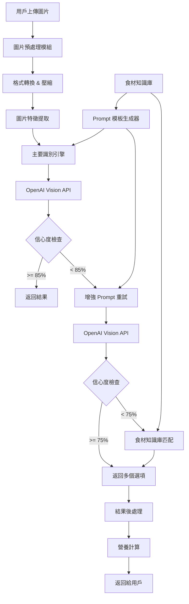

# Design Document - 食物識別準確度改進

## Overview

本設計文檔描述如何改進現有的食物識別系統，提升對亞洲料理和食材的整體識別準確度。系統目前使用 OpenAI Vision API (GPT-4o) 進行圖像分析，但在識別亞洲特色食材和料理時存在準確度問題，例如將豆腐干絲誤識別為麵條、無法正確識別涼拌菜的所有食材、混淆相似的亞洲食材等。

### 核心問題分析

1. **亞洲食材識別錯誤**：
   - 豆製品（豆腐干絲、豆皮、豆腐等）被誤識別
   - 相似食材混淆（米粉 vs 粉絲、玉米筍 vs 小玉米、糯米椒 vs 青椒）
   - 特殊食材無法識別（馬告、刺蔥、過貓等）

2. **亞洲料理特徵識別不足**：
   - 烹飪方式識別不準確（涼拌、清蒸、紅燒、滷等）
   - 料理類型判斷錯誤（中式、台式、日式、韓式等）
   - 醬汁和調味料經常被忽略

3. **混合食材菜餚處理不佳**：
   - 複雜菜餚中的食材遺漏
   - 無法識別所有可見成分
   - 份量估算不準確

4. **缺乏文化背景知識**：
   - 不了解亞洲料理的常見搭配
   - 缺少對地方特色菜的認知
   - 無法識別傳統烹飪器具和擺盤方式

### 解決方案概述

通過建立亞洲料理專用知識庫、優化 prompt 工程、增強圖像預處理、實施多階段識別流程，以及持續學習機制來全面提升亞洲料理和食材的識別準確度。

## Architecture

### 系統架構圖



### 數據流

1. **輸入階段**：用戶上傳圖片 → 格式驗證 → 大小檢查
2. **預處理階段**：HEIC 轉換 → JPEG 壓縮 → 特徵提取
3. **識別階段**：
   - 第一次嘗試：使用標準 prompt
   - 第二次嘗試（如需要）：使用增強 prompt + 食材提示
   - 第三次嘗試（如需要）：使用知識庫匹配
4. **後處理階段**：結果驗證 → 營養計算 → 格式化輸出

## Components and Interfaces

### 1. Enhanced Prompt Generator (增強 Prompt 生成器)

**職責**：根據圖片特徵和歷史數據生成優化的 prompt，特別針對亞洲料理

**接口**：
```typescript
interface PromptGeneratorConfig {
  imageFeatures?: ImageFeatures;
  detectedCuisineType?: CuisineType;
  previousAttempts?: number;
  userFeedback?: UserFeedback[];
  suspectedFoodCategories?: FoodCategory[];
}

interface ImageFeatures {
  dominantColors: string[];
  textureType: 'smooth' | 'rough' | 'mixed';
  shapePatterns: string[];
  estimatedComplexity: number;
  hasMultipleComponents: boolean;
  plateType?: 'bowl' | 'plate' | 'bamboo' | 'stone' | 'leaf';
}

class EnhancedPromptGenerator {
  // 主要生成方法
  generatePrompt(config: PromptGeneratorConfig): string;
  
  // 料理類型專用 prompt
  generateAsianCuisinePrompt(): string;
  generateChinesePrompt(): string;
  generateTaiwanesePrompt(): string;
  generateJapanesePrompt(): string;
  generateKoreanPrompt(): string;
  
  // 食材類別專用 prompt
  generateBeanProductPrompt(): string;
  generateNoodleTypePrompt(): string;
  generateVegetablePrompt(): string;
  generateSeafoodPrompt(): string;
  
  // 菜餚類型專用 prompt
  generateMixedDishPrompt(): string;
  generateColdDishPrompt(): string; // 涼拌菜
  generateStirFryPrompt(): string; // 熱炒
  generateSoupPrompt(): string;
  
  // 特殊場景 prompt
  generateIndigenousFoodPrompt(): string; // 原住民料理
  generateStreetFoodPrompt(): string; // 街頭小吃
  
  // Prompt 增強器
  addConfusionWarnings(prompt: string, confusedPairs: string[][]): string;
  addRegionalContext(prompt: string, region: string): string;
  addSeasonalContext(prompt: string, season: string): string;
}
```

**實現策略**：
- 建立完整的亞洲料理 prompt 模板庫
- 包含各類易混淆食材的詳細區分指引
- 整合地方特色和文化背景知識
- 動態調整 prompt 詳細程度和重點
- 根據圖片特徵選擇最適合的 prompt 模板

### 2. Asian Cuisine Knowledge Base (亞洲料理知識庫)

**職責**：存儲亞洲食材特徵、料理知識、營養資訊和識別規則

**數據結構**：
```typescript
interface FoodItem {
  id: string;
  name: string;
  nameVariants: string[]; // 別名（包含各地方言）
  category: FoodCategory;
  subcategory?: string;
  visualFeatures: VisualFeatures;
  nutritionPer100g: NutritionInfo;
  commonConfusions: string[]; // 易混淆食材
  distinguishingFeatures: string[]; // 區分特徵
  cookingMethods: string[];
  cuisineTypes: CuisineType[];
  regionalVariants?: RegionalVariant[]; // 地方變體
  commonPairings?: string[]; // 常見搭配
  seasonality?: string[]; // 季節性
}

interface VisualFeatures {
  color: string[];
  shape: string[];
  texture: string[];
  size: string;
  appearance: string;
  surfaceCharacteristics: string[]; // 表面特徵
  crossSectionAppearance?: string; // 切面外觀
}

enum FoodCategory {
  BEAN_PRODUCTS = '豆製品',
  VEGETABLES = '蔬菜',
  LEAFY_GREENS = '葉菜類',
  ROOT_VEGETABLES = '根莖類',
  MUSHROOMS = '菇類',
  PROTEINS = '蛋白質',
  SEAFOOD = '海鮮',
  GRAINS = '穀物',
  NOODLES = '麵食',
  RICE_PRODUCTS = '米製品',
  SAUCES = '醬汁',
  CONDIMENTS = '調味料',
  PICKLES = '醃漬物',
  MIXED_DISH = '混合菜餚',
  SOUP = '湯品',
  TAIWANESE_SPECIALTY = '台灣特色',
  INDIGENOUS_FOOD = '原住民食材'
}

enum CuisineType {
  CHINESE = '中式',
  TAIWANESE = '台式',
  JAPANESE = '日式',
  KOREAN = '韓式',
  THAI = '泰式',
  VIETNAMESE = '越式',
  CANTONESE = '粵菜',
  SICHUAN = '川菜',
  HAKKA = '客家菜',
  INDIGENOUS = '原住民料理'
}

interface RegionalVariant {
  region: string;
  localName: string;
  differences: string[];
}
```

**知識庫內容範例**：
```typescript
const ASIAN_FOOD_KB = {
  // 豆製品類
  '豆腐干絲': {
    id: 'tofu_strips',
    name: '豆腐干絲',
    nameVariants: ['干絲', '豆干絲', '豆腐絲', '乾絲'],
    category: FoodCategory.BEAN_PRODUCTS,
    visualFeatures: {
      color: ['淡黃色', '米白色', '淺棕色'],
      shape: ['細長條狀', '絲狀'],
      texture: ['有韌性', '略粗糙', '不透明', '有嚼勁'],
      size: '長約5-8cm，寬約2-3mm，厚約1-2mm',
      appearance: '成束狀排列，表面略乾燥，有豆製品特有的質感',
      surfaceCharacteristics: ['表面有細微紋理', '不光滑', '略帶粗糙感']
    },
    commonConfusions: ['麵條', '米粉', '粉絲', '金針菇'],
    distinguishingFeatures: [
      '比麵條更粗且更有韌性',
      '顏色偏黃白色，不像麵條那麼白',
      '表面有豆製品特有的紋理和質感',
      '不會像麵條那樣光滑有光澤',
      '通常與芹菜、胡蘿蔔絲等涼拌',
      '切面呈方形或長方形，不是圓形'
    ],
    cookingMethods: ['涼拌', '炒', '燙', '拌'],
    cuisineTypes: [CuisineType.CHINESE, CuisineType.TAIWANESE],
    commonPairings: ['芹菜絲', '胡蘿蔔絲', '香菜', '麻油', '醬油']
  },
  
  '米粉': {
    id: 'rice_noodles',
    name: '米粉',
    nameVariants: ['炊粉', '粗米粉', '細米粉'],
    category: FoodCategory.RICE_PRODUCTS,
    visualFeatures: {
      color: ['白色', '半透明白'],
      shape: ['細長圓形', '扁平狀'],
      texture: ['柔軟', '易斷', '光滑'],
      size: '直徑0.5-2mm，長度不定',
      appearance: '表面光滑，有米製品特有的光澤'
    },
    commonConfusions: ['粉絲', '麵條', '豆腐干絲'],
    distinguishingFeatures: [
      '純白色，比麵條更白',
      '質地較脆，容易斷',
      '有米的香味',
      '泡水後會變軟',
      '表面光滑但不如麵條有彈性'
    ],
    cuisineTypes: [CuisineType.TAIWANESE, CuisineType.CHINESE]
  },
  
  '粉絲': {
    id: 'glass_noodles',
    name: '粉絲',
    nameVariants: ['冬粉', '綠豆粉絲', '龍口粉絲'],
    category: FoodCategory.NOODLES,
    visualFeatures: {
      color: ['透明', '半透明', '灰白色'],
      shape: ['極細絲狀'],
      texture: ['滑溜', '透明', '有彈性'],
      size: '直徑0.3-0.8mm，非常細',
      appearance: '煮熟後呈透明或半透明狀'
    },
    commonConfusions: ['米粉', '麵線'],
    distinguishingFeatures: [
      '煮熟後呈透明狀',
      '非常細，比米粉更細',
      '有滑溜感',
      '通常用於湯品或涼拌'
    ]
  },
  
  // 蔬菜類
  '玉米筍': {
    id: 'baby_corn',
    name: '玉米筍',
    nameVariants: ['珍珠筍', '幼玉米'],
    category: FoodCategory.VEGETABLES,
    visualFeatures: {
      color: ['淡黃色', '黃白色', '奶白色'],
      shape: ['細長圓柱形', '筆直'],
      texture: ['脆嫩', '光滑'],
      size: '長5-8cm，直徑0.8-1.5cm',
      appearance: '整根可食用，頂端有細小玉米鬚',
      surfaceCharacteristics: ['表面光滑', '有細微縱向紋路']
    },
    commonConfusions: ['小玉米', '筍子'],
    distinguishingFeatures: [
      '整根呈圓柱形，粗細均勻',
      '頂端有玉米鬚',
      '可以整根食用',
      '常見於炒菜和火鍋',
      '切開後沒有明顯的玉米粒'
    ],
    cuisineTypes: [CuisineType.CHINESE, CuisineType.TAIWANESE, CuisineType.THAI]
  },
  
  '糯米椒': {
    id: 'shishito_pepper',
    name: '糯米椒',
    nameVariants: ['甜椒仔', '青龍椒'],
    category: FoodCategory.VEGETABLES,
    visualFeatures: {
      color: ['綠色', '深綠色'],
      shape: ['細長形', '略彎曲'],
      texture: ['表面有皺褶', '薄皮'],
      size: '長8-12cm，直徑1.5-2cm',
      appearance: '表面有不規則皺褶，尖端略尖',
      surfaceCharacteristics: ['表面皺褶明顯', '不光滑']
    },
    commonConfusions: ['青椒', '辣椒'],
    distinguishingFeatures: [
      '比青椒小且細長',
      '表面有明顯皺褶',
      '通常整根烹調',
      '微辣或不辣',
      '常見於台式熱炒'
    ],
    cuisineTypes: [CuisineType.TAIWANESE, CuisineType.JAPANESE]
  },
  
  '青椒': {
    id: 'bell_pepper',
    name: '青椒',
    nameVariants: ['甜椒', '燈籠椒'],
    category: FoodCategory.VEGETABLES,
    visualFeatures: {
      color: ['綠色', '深綠色'],
      shape: ['方形', '圓形', '燈籠狀'],
      texture: ['表面光滑', '肉厚'],
      size: '長8-12cm，寬6-10cm',
      appearance: '表面光滑有光澤，內部有空腔',
      surfaceCharacteristics: ['表面非常光滑', '有光澤'],
      crossSectionAppearance: '切開後有明顯空腔，壁厚'
    },
    commonConfusions: ['糯米椒', '辣椒'],
    distinguishingFeatures: [
      '體型較大，呈方形或圓形',
      '表面光滑無皺褶',
      '肉厚，切開有空腔',
      '不辣',
      '通常切塊或切絲烹調'
    ]
  },
  
  // 台灣特色食材
  '過貓': {
    id: 'guomao',
    name: '過貓',
    nameVariants: ['過溝菜蕨', '山鳳尾'],
    category: FoodCategory.TAIWANESE_SPECIALTY,
    subcategory: '蕨類蔬菜',
    visualFeatures: {
      color: ['深綠色', '翠綠色'],
      shape: ['捲曲狀', '羽狀'],
      texture: ['嫩滑', '脆嫩'],
      size: '長10-15cm',
      appearance: '嫩芽呈捲曲狀，展開後呈羽狀'
    },
    distinguishingFeatures: [
      '嫩芽呈捲曲狀',
      '口感滑嫩',
      '台灣特有野菜',
      '通常川燙後涼拌或清炒'
    ],
    cuisineTypes: [CuisineType.TAIWANESE],
    cookingMethods: ['川燙', '涼拌', '清炒']
  },
  
  '馬告': {
    id: 'maqaw',
    name: '馬告',
    nameVariants: ['山胡椒', '山雞椒'],
    category: FoodCategory.INDIGENOUS_FOOD,
    subcategory: '香料',
    visualFeatures: {
      color: ['黑色', '深褐色'],
      shape: ['圓形小顆粒'],
      texture: ['乾燥', '堅硬'],
      size: '直徑3-5mm',
      appearance: '類似黑胡椒，但有檸檬香氣'
    },
    distinguishingFeatures: [
      '有獨特的檸檬香氣',
      '原住民常用香料',
      '比黑胡椒略大',
      '常用於烤肉和湯品'
    ],
    cuisineTypes: [CuisineType.INDIGENOUS, CuisineType.TAIWANESE]
  },
  
  // 醬汁和調味料
  '麻油': {
    id: 'sesame_oil',
    name: '麻油',
    nameVariants: ['香油', '芝麻油'],
    category: FoodCategory.CONDIMENTS,
    visualFeatures: {
      color: ['深褐色', '琥珀色'],
      appearance: '油狀液體，有光澤'
    },
    distinguishingFeatures: [
      '有濃郁芝麻香味',
      '常用於涼拌菜',
      '顏色較深'
    ],
    cuisineTypes: [CuisineType.CHINESE, CuisineType.TAIWANESE]
  }
};

// 料理知識庫
const DISH_PATTERNS_KB = {
  '涼拌菜': {
    commonIngredients: ['豆腐干絲', '芹菜', '胡蘿蔔', '黃瓜', '木耳'],
    commonSeasonings: ['麻油', '醬油', '醋', '糖', '蒜末'],
    visualCharacteristics: [
      '食材切成絲狀或片狀',
      '顏色豐富多彩',
      '通常裝在盤子中',
      '表面可見油光（麻油）',
      '食材混合均勻'
    ],
    cookingMethod: '涼拌',
    cuisineTypes: [CuisineType.CHINESE, CuisineType.TAIWANESE]
  },
  
  '台式熱炒': {
    commonIngredients: ['糯米椒', '豆乾', '肉絲', '蒜片', '辣椒'],
    visualCharacteristics: [
      '食材呈炒製狀',
      '有鍋氣（略焦）',
      '油亮',
      '食材大小不一'
    ],
    cookingMethod: '快炒',
    cuisineTypes: [CuisineType.TAIWANESE]
  }
};
```

### 3. Multi-Stage Recognition Engine (多階段識別引擎)

**職責**：協調多次識別嘗試和結果整合

**接口**：
```typescript
interface RecognitionStage {
  attempt: number;
  promptType: 'standard' | 'enhanced' | 'specialized';
  result: RecognitionResult;
  confidence: number;
  timestamp: Date;
}

interface RecognitionResult {
  foods: FoodSuggestion[];
  overallConfidence: number;
  description: string;
  cookingMethod?: string;
  cuisineType?: string;
  alternatives?: FoodSuggestion[][]; // 替代選項
}

class MultiStageRecognitionEngine {
  async recognize(imageBuffer: Buffer): Promise<RecognitionResult>;
  private async attemptStandard(imageBuffer: Buffer): Promise<RecognitionStage>;
  private async attemptEnhanced(imageBuffer: Buffer, previousResult: RecognitionStage): Promise<RecognitionStage>;
  private async attemptKnowledgeBase(imageBuffer: Buffer, previousResults: RecognitionStage[]): Promise<RecognitionStage>;
  private mergeResults(stages: RecognitionStage[]): RecognitionResult;
}
```

**識別流程**：
```
第一階段（標準識別）
├─ 使用基礎 prompt
├─ 信心度 >= 85% → 直接返回
└─ 信心度 < 85% → 進入第二階段

第二階段（增強識別）
├─ 分析第一階段結果
├─ 識別可能的食材類型
├─ 使用專門的 prompt（如豆製品專用 prompt）
├─ 信心度 >= 75% → 返回多個選項
└─ 信心度 < 75% → 進入第三階段

第三階段（知識庫匹配）
├─ 提取圖片視覺特徵
├─ 在知識庫中搜索匹配項
├─ 計算相似度分數
└─ 返回前3個最可能的選項
```

### 4. Result Validator (結果驗證器)

**職責**：驗證識別結果的合理性，特別針對亞洲料理的常見模式

**接口**：
```typescript
interface ValidationRule {
  name: string;
  check: (result: RecognitionResult) => ValidationResult;
  severity: 'error' | 'warning' | 'info';
  applicableCuisines?: CuisineType[];
}

interface ValidationResult {
  passed: boolean;
  message: string;
  suggestions?: string[];
  affectedFoods?: string[];
}

class ResultValidator {
  private rules: ValidationRule[];
  private knowledgeBase: AsianCuisineKnowledgeBase;
  
  validate(result: RecognitionResult): ValidationResult[];
  addRule(rule: ValidationRule): void;
  
  // 內建驗證規則
  private validateFoodCombination(foods: FoodSuggestion[]): ValidationResult;
  private validateNutritionValues(food: FoodSuggestion): ValidationResult;
  private validatePortionSizes(food: FoodSuggestion): ValidationResult;
  private validateCuisineConsistency(result: RecognitionResult): ValidationResult;
  private validateCookingMethodMatch(result: RecognitionResult): ValidationResult;
  private validateCommonPairings(foods: FoodSuggestion[]): ValidationResult;
  private validateSeasonalConsistency(foods: FoodSuggestion[], season: string): ValidationResult;
  private validateRegionalConsistency(result: RecognitionResult): ValidationResult;
}
```

**驗證規則範例**：
```typescript
const ASIAN_CUISINE_VALIDATION_RULES = [
  {
    name: '相似食材互斥檢查',
    check: (result) => {
      const confusionPairs = [
        ['豆腐干絲', '麵條'],
        ['米粉', '粉絲'],
        ['玉米筍', '筍子'],
        ['糯米椒', '青椒'],
        ['過貓', '空心菜']
      ];
      
      for (const [food1, food2] of confusionPairs) {
        const hasFood1 = result.foods.some(f => f.food.name.includes(food1));
        const hasFood2 = result.foods.some(f => f.food.name.includes(food2));
        
        if (hasFood1 && hasFood2) {
          return {
            passed: false,
            message: `同時識別到 ${food1} 和 ${food2}，這兩者容易混淆`,
            suggestions: [
              `檢查視覺特徵：${food1} vs ${food2}`,
              '確認烹飪方式和料理類型',
              '查看知識庫中的區分特徵'
            ],
            affectedFoods: [food1, food2]
          };
        }
      }
      return { passed: true, message: 'OK' };
    },
    severity: 'warning'
  },
  
  {
    name: '涼拌菜完整性檢查',
    check: (result) => {
      if (result.cookingMethod === '涼拌') {
        const expectedComponents = ['主食材', '配菜', '調味料'];
        const hasMainIngredient = result.foods.some(f => 
          ['豆腐干絲', '海蜇皮', '木耳', '黃瓜'].some(ing => f.food.name.includes(ing))
        );
        const hasVegetables = result.foods.some(f => 
          f.food.category === FoodCategory.VEGETABLES
        );
        const hasSeasoning = result.foods.some(f => 
          ['麻油', '醬油', '醋'].some(s => f.food.name.includes(s))
        );
        
        const missing = [];
        if (!hasMainIngredient) missing.push('主食材');
        if (!hasVegetables) missing.push('配菜');
        if (!hasSeasoning) missing.push('調味料');
        
        if (missing.length > 0) {
          return {
            passed: false,
            message: `涼拌菜缺少：${missing.join('、')}`,
            suggestions: [
              '涼拌菜通常包含主食材、配菜和調味料',
              '檢查是否有遺漏的食材',
              '注意醬汁和調味料也要識別'
            ]
          };
        }
      }
      return { passed: true, message: 'OK' };
    },
    severity: 'warning',
    applicableCuisines: [CuisineType.CHINESE, CuisineType.TAIWANESE]
  },
  
  {
    name: '台式熱炒常見搭配檢查',
    check: (result) => {
      if (result.cuisineType === CuisineType.TAIWANESE && 
          result.cookingMethod === '快炒') {
        const hasGarlic = result.foods.some(f => f.food.name.includes('蒜'));
        const hasChili = result.foods.some(f => 
          f.food.name.includes('辣椒') || f.food.name.includes('糯米椒')
        );
        
        if (!hasGarlic && !hasChili) {
          return {
            passed: false,
            message: '台式熱炒通常會有蒜片或辣椒',
            suggestions: ['檢查是否有蒜片或辣椒']
          };
        }
      }
      return { passed: true, message: 'OK' };
    },
    severity: 'info',
    applicableCuisines: [CuisineType.TAIWANESE]
  },
  
  {
    name: '原住民料理特徵檢查',
    check: (result) => {
      const indigenousIngredients = ['小米', '馬告', '刺蔥', '過貓', '山蘇'];
      const hasIndigenousFood = result.foods.some(f => 
        indigenousIngredients.some(ing => f.food.name.includes(ing))
      );
      
      if (hasIndigenousFood && result.cuisineType !== CuisineType.INDIGENOUS) {
        return {
          passed: false,
          message: '檢測到原住民特色食材，但料理類型未標記為原住民料理',
          suggestions: ['確認料理類型是否應為原住民料理']
        };
      }
      return { passed: true, message: 'OK' };
    },
    severity: 'info'
  },
  
  {
    name: '日式料理完整性檢查',
    check: (result) => {
      if (result.cuisineType === CuisineType.JAPANESE) {
        const hasSoup = result.foods.some(f => 
          f.food.name.includes('湯') || f.food.name.includes('味噌')
        );
        const hasRice = result.foods.some(f => 
          f.food.name.includes('飯') || f.food.name.includes('米')
        );
        const hasPickles = result.foods.some(f => 
          f.food.name.includes('漬物') || f.food.name.includes('醃')
        );
        
        // 日式定食通常包含飯、湯、主菜、配菜
        if (result.foods.length >= 3 && !hasSoup && !hasPickles) {
          return {
            passed: false,
            message: '日式套餐通常包含湯品或醃漬物',
            suggestions: ['檢查是否有味噌湯或醃漬物']
          };
        }
      }
      return { passed: true, message: 'OK' };
    },
    severity: 'info',
    applicableCuisines: [CuisineType.JAPANESE]
  },
  
  {
    name: '食材份量合理性檢查',
    check: (result) => {
      for (const food of result.foods) {
        const portion = food.food.portion;
        // 檢查份量是否包含具體數字
        if (!portion.match(/\d+/)) {
          return {
            passed: false,
            message: `${food.food.name} 的份量描述不夠具體`,
            suggestions: ['份量應包含具體數字和單位'],
            affectedFoods: [food.food.name]
          };
        }
      }
      return { passed: true, message: 'OK' };
    },
    severity: 'warning'
  }
];
```

### 5. User Feedback Collector (用戶反饋收集器)

**職責**：收集用戶對識別結果的反饋，用於改進系統

**接口**：
```typescript
interface UserFeedback {
  imageId: string;
  recognitionResult: RecognitionResult;
  userCorrection: {
    correctFoods: string[];
    incorrectFoods: string[];
    missingFoods: string[];
  };
  timestamp: Date;
  userId?: string;
}

class FeedbackCollector {
  async submitFeedback(feedback: UserFeedback): Promise<void>;
  async getFeedbackStats(): Promise<FeedbackStats>;
  async getCommonMistakes(): Promise<MistakePattern[]>;
}

interface MistakePattern {
  incorrectIdentification: string;
  correctIdentification: string;
  frequency: number;
  imageFeatures: ImageFeatures;
}
```

## Data Models

### 1. Enhanced Food Suggestion

```typescript
interface EnhancedFoodSuggestion {
  food: {
    id: string;
    name: string;
    calories: number;
    protein: number;
    carbs: number;
    fat: number;
    fiber: number;
    sodium: number;
    category: string;
    portion: string;
    description: string;
    cooking_method: string;
    cuisine_type: string;
    // 新增欄位
    visualDescription?: string; // 視覺描述
    distinguishingFeatures?: string[]; // 區分特徵
    alternatives?: string[]; // 可能的替代識別
  };
  confidence: number;
  // 新增欄位
  recognitionStage: number; // 在第幾階段識別出來
  matchedFeatures: string[]; // 匹配的特徵
  uncertaintyReasons?: string[]; // 不確定的原因
}
```

### 2. Recognition Session

```typescript
interface RecognitionSession {
  sessionId: string;
  imageId: string;
  imageMetadata: {
    originalName: string;
    size: number;
    format: string;
    dimensions?: { width: number; height: number };
  };
  stages: RecognitionStage[];
  finalResult: RecognitionResult;
  processingTime: number;
  apiCalls: number;
  userFeedback?: UserFeedback;
  createdAt: Date;
}
```

## Error Handling

### 錯誤類型定義

```typescript
enum RecognitionErrorType {
  IMAGE_FORMAT_ERROR = 'IMAGE_FORMAT_ERROR',
  IMAGE_TOO_LARGE = 'IMAGE_TOO_LARGE',
  API_RATE_LIMIT = 'API_RATE_LIMIT',
  API_REJECTION = 'API_REJECTION',
  LOW_CONFIDENCE = 'LOW_CONFIDENCE',
  VALIDATION_FAILED = 'VALIDATION_FAILED',
  UNKNOWN_ERROR = 'UNKNOWN_ERROR'
}

class RecognitionError extends Error {
  type: RecognitionErrorType;
  details: any;
  recoverable: boolean;
  suggestedAction: string;
}
```

### 錯誤處理策略

```typescript
const ERROR_HANDLING_STRATEGIES = {
  [RecognitionErrorType.API_REJECTION]: {
    retry: true,
    maxRetries: 2,
    backoffMs: 1000,
    fallback: 'useEnhancedPrompt',
    userMessage: '圖片分析遇到困難，正在使用增強模式重試...'
  },
  [RecognitionErrorType.LOW_CONFIDENCE]: {
    retry: false,
    fallback: 'provideMultipleOptions',
    userMessage: '識別信心度較低，為您提供多個可能的選項'
  },
  [RecognitionErrorType.IMAGE_TOO_LARGE]: {
    retry: true,
    maxRetries: 1,
    fallback: 'compressImage',
    userMessage: '圖片過大，正在壓縮後重試...'
  }
};
```

## Testing Strategy

### 1. 單元測試

**測試範圍**：
- Prompt Generator 的各種場景
- Knowledge Base 查詢功能
- Result Validator 的驗證規則
- 圖片預處理功能

**測試案例範例**：
```typescript
describe('EnhancedPromptGenerator', () => {
  it('should generate bean product specific prompt', () => {
    const generator = new EnhancedPromptGenerator();
    const prompt = generator.generateBeanProductPrompt();
    
    expect(prompt).toContain('豆腐干絲');
    expect(prompt).toContain('麵條');
    expect(prompt).toContain('區分特徵');
  });
  
  it('should include confusion warnings in prompt', () => {
    const generator = new EnhancedPromptGenerator();
    const config = {
      previousAttempts: 1,
      userFeedback: [{ incorrectFood: '麵條', correctFood: '豆腐干絲' }]
    };
    const prompt = generator.generatePrompt(config);
    
    expect(prompt).toContain('注意區分');
    expect(prompt).toContain('豆腐干絲');
  });
});
```

### 2. 整合測試

**測試範圍**：
- 完整的多階段識別流程
- API 調用和重試機制
- 結果驗證和後處理

**測試案例範例**：
```typescript
describe('MultiStageRecognitionEngine', () => {
  it('should retry with enhanced prompt on low confidence', async () => {
    const engine = new MultiStageRecognitionEngine();
    const mockImage = await loadTestImage('liangban_gansi.jpg');
    
    const result = await engine.recognize(mockImage);
    
    expect(result.foods).toContainEqual(
      expect.objectContaining({ name: '豆腐干絲' })
    );
    expect(result.overallConfidence).toBeGreaterThan(0.75);
  });
});
```

### 3. 端到端測試

**測試場景**：
- 涼拌干絲識別
- 混合食材菜餚識別
- 低信心度場景處理
- 用戶反饋流程

**測試數據集**：
```
test-images/
├── asian-cuisine/
│   ├── liangban-gansi-01.jpg
│   ├── liangban-gansi-02.jpg
│   ├── liangban-gansi-03.jpg
│   └── ...
├── confusing-pairs/
│   ├── tofu-vs-noodles-01.jpg
│   ├── tofu-vs-noodles-02.jpg
│   └── ...
└── mixed-dishes/
    ├── mixed-salad-01.jpg
    └── ...
```

### 4. 準確度測試

**評估指標**：
```typescript
interface AccuracyMetrics {
  precision: number; // 精確率
  recall: number; // 召回率
  f1Score: number; // F1 分數
  confusionMatrix: Map<string, Map<string, number>>; // 混淆矩陣
  avgConfidence: number; // 平均信心度
  avgProcessingTime: number; // 平均處理時間
}

class AccuracyTester {
  async testDataset(images: TestImage[]): Promise<AccuracyMetrics>;
  async generateReport(): Promise<TestReport>;
}
```

**測試流程**：
1. 準備標註好的測試圖片集（至少100張）
2. 運行識別系統
3. 比對識別結果與標註
4. 計算準確度指標
5. 生成詳細報告

**目標準確度**：
- 豆製品識別準確率：>= 90%
- 混合食材識別召回率：>= 85%
- 整體 F1 分數：>= 0.88

## Implementation Plan

### Phase 1: 基礎設施（1-2天）

1. 建立食材知識庫數據結構
2. 實現 Enhanced Prompt Generator
3. 設置測試框架和測試數據集

### Phase 2: 核心功能（2-3天）

1. 實現 Multi-Stage Recognition Engine
2. 整合知識庫匹配邏輯
3. 實現 Result Validator
4. 優化現有 prompt

### Phase 3: 測試和優化（2-3天）

1. 運行準確度測試
2. 根據測試結果調整 prompt 和規則
3. 實現用戶反饋收集
4. 性能優化

### Phase 4: 部署和監控（1天）

1. 部署到生產環境
2. 設置監控和日誌
3. 建立持續改進流程

## Performance Considerations

### 1. API 調用優化

- 實施智能重試策略，避免不必要的 API 調用
- 緩存常見食材的識別結果
- 批次處理多張圖片時的請求合併

### 2. 響應時間目標

- 第一階段識別：< 3秒
- 多階段識別（含重試）：< 8秒
- 知識庫查詢：< 100ms

### 3. 資源使用

- 圖片壓縮後大小：< 2MB
- 內存使用：< 512MB per request
- 知識庫大小：< 50MB

## Monitoring and Logging

### 關鍵指標

```typescript
interface RecognitionMetrics {
  totalRequests: number;
  successRate: number;
  avgConfidence: number;
  avgProcessingTime: number;
  retryRate: number;
  userCorrectionRate: number;
  topMisidentifications: MistakePattern[];
}
```

### 日誌記錄

```typescript
interface RecognitionLog {
  timestamp: Date;
  sessionId: string;
  imageId: string;
  stages: {
    stage: number;
    promptType: string;
    apiResponse: any;
    confidence: number;
    processingTime: number;
  }[];
  finalResult: RecognitionResult;
  validationResults: ValidationResult[];
  userFeedback?: UserFeedback;
}
```

## Security and Privacy

### 圖片處理安全

- 驗證圖片格式和大小
- 掃描惡意內容
- 自動刪除處理後的臨時文件

### 數據隱私

- 不存儲原始圖片（除非用戶明確同意）
- 匿名化用戶反饋數據
- 遵守 GDPR 和相關隱私法規

## Future Enhancements

1. **機器學習模型整合**：訓練專門的食材分類模型
2. **多語言支持**：支持英文、日文等其他語言
3. **AR 輔助識別**：實時相機識別
4. **社群貢獻**：允許用戶貢獻食材數據
5. **個性化學習**：根據用戶飲食習慣優化識別
