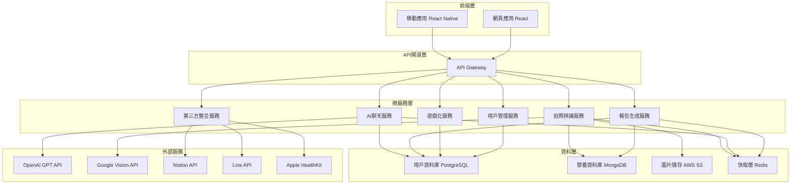

# 設計文件

## 概述

健康營養追蹤系統採用微服務架構，結合現代AI技術和雲端服務，提供完整的健康管理解決方案。系統設計重點在於可擴展性、即時性和用戶體驗，透過模組化設計確保各功能組件的獨立性和可維護性。

## 架構

### 系統架構圖



### 技術堆疊

**前端**
- React Native (移動應用)
- React + TypeScript (網頁應用)
- Redux Toolkit (狀態管理)
- React Query (資料獲取)

**後端**
- Node.js + Express (API服務)
- Python + FastAPI (AI/ML服務)
- Docker + Kubernetes (容器化部署)
- NGINX (負載均衡)

**資料庫**
- PostgreSQL (結構化資料)
- MongoDB (非結構化資料)
- Redis (快取和會話)

**雲端服務**
- AWS EC2/ECS (運算)
- AWS S3 (檔案儲存)
- AWS CloudWatch (監控)
- AWS Lambda (無伺服器函數)

## 組件和介面

### 1. 拍照辨識模組

**核心組件:**
- ImageProcessor: 處理圖片預處理和格式轉換
- FoodRecognitionEngine: 整合Google Vision API進行食物辨識
- NutritionCalculator: 計算營養成分和熱量
- ConfidenceValidator: 驗證辨識結果的可信度

**API介面:**
```typescript
interface PhotoRecognitionAPI {
  uploadPhoto(image: File): Promise<RecognitionResult>
  confirmFood(foodId: string, portion: number): Promise<NutritionData>
  getFoodSuggestions(query: string): Promise<FoodItem[]>
}

interface RecognitionResult {
  foods: DetectedFood[]
  confidence: number
  processingTime: number
}

interface DetectedFood {
  id: string
  name: string
  confidence: number
  estimatedPortion: number
  nutrition: NutritionData
}
```

### 2. AI聊天顧問模組

**核心組件:**
- ConversationManager: 管理對話流程和上下文
- NutritionAnalyzer: 分析用戶營養攝取模式
- RecommendationEngine: 生成個人化建議
- ContextMemory: 維護對話歷史和用戶偏好

**API介面:**
```typescript
interface ChatAdvisorAPI {
  sendMessage(message: string, userId: string): Promise<ChatResponse>
  getRecommendations(userId: string): Promise<Recommendation[]>
  analyzeNutritionPattern(userId: string, days: number): Promise<NutritionAnalysis>
}

interface ChatResponse {
  message: string
  suggestions: string[]
  actionItems: ActionItem[]
  confidence: number
}
```

### 3. 第三方整合模組

**核心組件:**
- NotionConnector: Notion資料庫同步
- LineConnector: Line通知和資料分享
- HealthKitConnector: Apple Health資料同步
- SyncScheduler: 管理同步排程和重試機制

**API介面:**
```typescript
interface IntegrationAPI {
  connectPlatform(platform: Platform, credentials: AuthCredentials): Promise<ConnectionResult>
  syncData(userId: string, platform: Platform): Promise<SyncResult>
  getConnectionStatus(userId: string): Promise<ConnectionStatus[]>
}

enum Platform {
  NOTION = 'notion',
  LINE = 'line',
  APPLE_HEALTH = 'apple_health'
}
```

### 4. 報告生成模組

**核心組件:**
- DataAggregator: 彙整用戶健康資料
- TrendAnalyzer: 分析健康趨勢和變化
- ReportTemplate: 報告模板和格式化
- DeliveryManager: 管理報告發送和通知

**API介面:**
```typescript
interface ReportAPI {
  generateWeeklyReport(userId: string): Promise<HealthReport>
  getReportHistory(userId: string, limit: number): Promise<HealthReport[]>
  customizeReportSettings(userId: string, settings: ReportSettings): Promise<void>
}

interface HealthReport {
  period: DateRange
  nutritionSummary: NutritionSummary
  trends: HealthTrend[]
  recommendations: string[]
  achievements: Achievement[]
}
```

### 5. 遊戲化系統模組

**核心組件:**
- TaskManager: 管理每日/週/月任務
- PointsCalculator: 計算積分和等級
- AchievementTracker: 追蹤成就和里程碑
- RewardSystem: 管理獎勵和徽章

**API介面:**
```typescript
interface GamificationAPI {
  getUserProgress(userId: string): Promise<UserProgress>
  completeTask(userId: string, taskId: string): Promise<TaskResult>
  getAvailableTasks(userId: string): Promise<Task[]>
  getLeaderboard(type: LeaderboardType): Promise<LeaderboardEntry[]>
}

interface UserProgress {
  level: number
  points: number
  streakDays: number
  achievements: Achievement[]
  currentTasks: Task[]
}
```

## 資料模型

### 用戶資料模型
```typescript
interface User {
  id: string
  email: string
  profile: UserProfile
  preferences: UserPreferences
  healthGoals: HealthGoal[]
  createdAt: Date
  updatedAt: Date
}

interface UserProfile {
  name: string
  age: number
  gender: 'male' | 'female' | 'other'
  height: number // cm
  weight: number // kg
  activityLevel: ActivityLevel
}

interface HealthGoal {
  type: GoalType
  target: number
  current: number
  deadline: Date
  status: GoalStatus
}
```

### 營養資料模型
```typescript
interface FoodItem {
  id: string
  name: string
  category: FoodCategory
  nutritionPer100g: NutritionData
  commonPortions: Portion[]
  tags: string[]
}

interface NutritionData {
  calories: number
  protein: number
  carbohydrates: number
  fat: number
  fiber: number
  sugar: number
  sodium: number
  vitamins: VitaminData
  minerals: MineralData
}

interface FoodLog {
  id: string
  userId: string
  foodId: string
  portion: number
  mealType: MealType
  timestamp: Date
  source: LogSource
  confidence?: number
}
```

## 錯誤處理

### 錯誤分類和處理策略

**1. 系統錯誤**
- 資料庫連接失敗: 自動重試機制，降級到快取資料
- 外部API失敗: 斷路器模式，提供預設回應
- 服務不可用: 健康檢查和自動重啟

**2. 用戶輸入錯誤**
- 無效圖片格式: 前端驗證和友善錯誤訊息
- 資料驗證失敗: 詳細的錯誤回饋和修正建議
- 認證失敗: 安全的重新認證流程

**3. 業務邏輯錯誤**
- 辨識結果不確定: 提供多選項和手動輸入
- 同步衝突: 時間戳記比較和衝突解決策略
- 資料不一致: 定期資料驗證和修復機制

### 錯誤監控和日誌

```typescript
interface ErrorHandler {
  logError(error: AppError): void
  notifyAdmins(criticalError: CriticalError): void
  generateErrorReport(): ErrorReport
}

interface AppError {
  code: string
  message: string
  severity: ErrorSeverity
  context: ErrorContext
  timestamp: Date
  userId?: string
}
```

## 測試策略

### 測試金字塔

**1. 單元測試 (70%)**
- 業務邏輯函數測試
- 資料模型驗證測試
- API端點單元測試
- 工具函數測試

**2. 整合測試 (20%)**
- 資料庫整合測試
- 外部API整合測試
- 微服務間通訊測試
- 第三方平台整合測試

**3. 端到端測試 (10%)**
- 關鍵用戶流程測試
- 跨平台功能測試
- 效能和負載測試
- 安全性測試

### 測試工具和框架

**前端測試**
- Jest + React Testing Library
- Cypress (E2E測試)
- Detox (React Native測試)

**後端測試**
- Jest + Supertest (Node.js)
- Pytest (Python)
- Docker Compose (整合測試環境)

**效能測試**
- Artillery (負載測試)
- Lighthouse (前端效能)
- New Relic (APM監控)

### 測試資料管理

```typescript
interface TestDataManager {
  createTestUser(): Promise<TestUser>
  seedNutritionDatabase(): Promise<void>
  cleanupTestData(): Promise<void>
  mockExternalAPIs(): void
}
```

## 安全性考量

### 資料保護
- 個人健康資料加密儲存
- GDPR合規的資料處理
- 定期資料備份和災難恢復

### 認證和授權
- JWT token認證
- OAuth 2.0第三方登入
- 角色基礎存取控制 (RBAC)

### API安全
- Rate limiting防止濫用
- Input validation防止注入攻擊
- HTTPS強制加密傳輸

## 效能優化

### 快取策略
- Redis快取熱門查詢
- CDN快取靜態資源
- 應用層快取營養資料

### 資料庫優化
- 索引優化查詢效能
- 讀寫分離架構
- 資料分片策略

### 前端優化
- 程式碼分割和懶載入
- 圖片壓縮和最佳化
- 離線功能支援